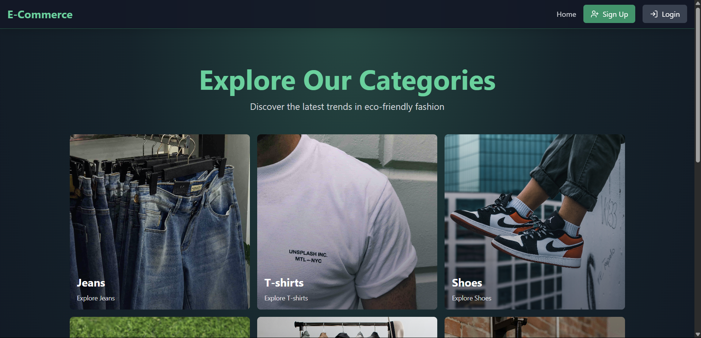
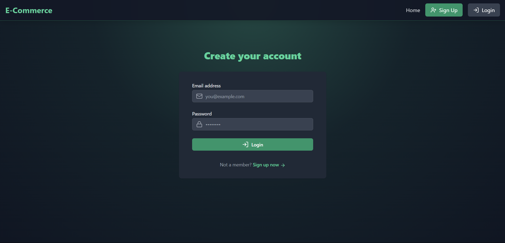
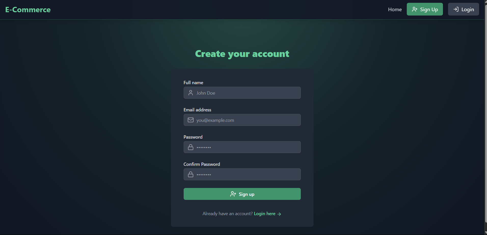
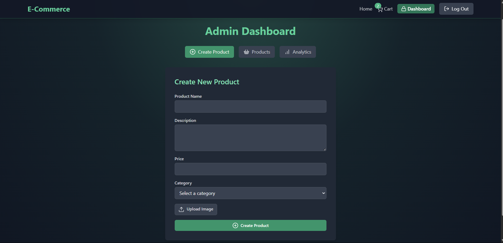
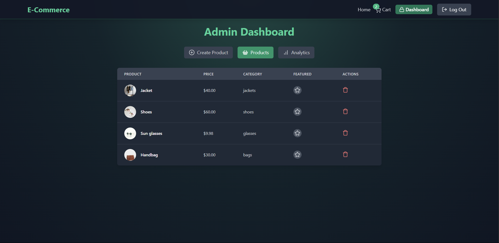
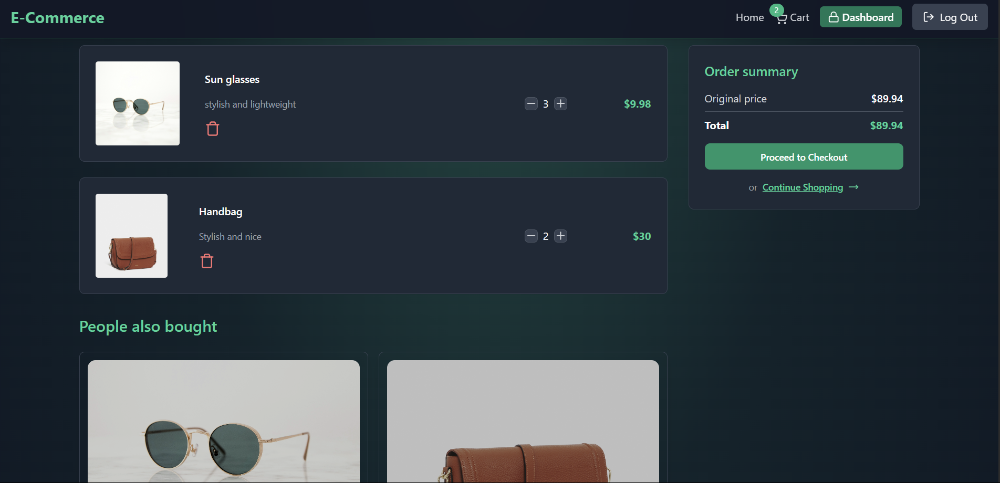

# 🛒 E-Commerce Store - Full Stack MERN Application

A modern and fully-featured e-commerce web app built with **MERN Stack** (MongoDB, Express.js, React.js, Node.js), with advanced integrations like **JWT Auth**, **Redis Caching**, and **Cloudinary** for image management.

---

## ✨ Features

### 🔐 Authentication

* User registration & login with hashed passwords
* Access & refresh tokens (JWT-based)
* Token invalidation via Redis
* Admin-only routes

### 🛍️ Product Management

* Add/Delete products (Admin only)
* Cloudinary integration for image upload
* View products by category
* Featured & recommended product APIs

### ⚙️ Admin Privileges

* Toggle featured products
* Control over products & coupons

---

## 🧱 Tech Stack

### Backend

* Node.js + Express.js
* MongoDB + Mongoose
* Redis (Upstash)
* JWT for authentication
* Cloudinary for image storage

### Frontend

* React.js (Vite)
* Tailwind CSS
* Axios
* React Router DOM

---

## 📁 Folder Structure

```
ecommerce-store/
├── backend/
│   ├── controllers/
│   ├── models/
│   ├── routes/
│   ├── middlewares/
│   ├── lib/
│   └── server.js
│
├── frontend/
│   ├── src/
│   ├── components/
│   ├── pages/
│   ├── App.jsx
│   └── main.jsx
```

---

### Frontend `.env`

```env
VITE_API_URL=http://localhost:5000/api
```

---

## 🚀 Getting Started

### 🛠 Backend Setup

```bash
cd backend
npm install
npm run dev
```

### 💻 Frontend Setup

```bash
cd frontend
npm install
npm run dev
```

## 🔄 API Highlights

* `POST /api/auth/signup` - Register user
* `POST /api/auth/login` - Login user
* `POST /api/auth/logout` - Clear tokens
* `GET /api/products` - Fetch all products
* `POST /api/products` - Add product (admin)

---

## 📸 Screenshots

### 🏠 Homepage


### 🔐 Login Page


### 📝 Signup Page


### 🛠️ Admin Page


### 🛒 Product Page


### 🛒 Cart Page



